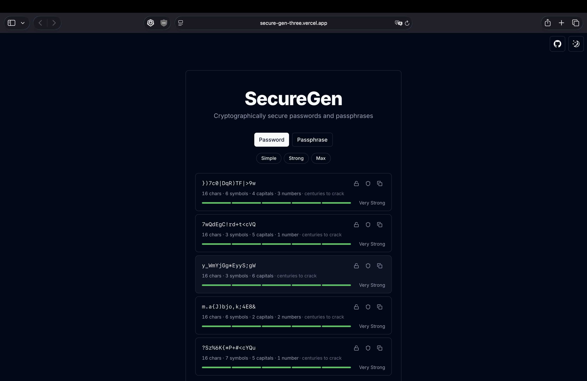

# SecureGen

Cryptographically secure password and passphrase generator — built with Next.js, React 19, and shadcn/ui.

**Live:** [secure-gen-three.vercel.app](https://secure-gen-three.vercel.app)



---

## Features

### Password generation

- Configurable length (8–32 characters)
- Toggle special characters, capitals, and numbers independently
- Exclude ambiguous characters (0/O, 1/l/I)
- Uses `crypto.getRandomValues` — no `Math.random()`

### Passphrase generation

- 3–10 words from a curated wordlist
- Separator options: hyphen, dot, underscore, space, or none
- Capitalize first letter of each word
- Optionally append a random number

### Batch output

- Generates 5 results at a time
- **Pin individual rows** — locked rows survive Regenerate All
- **Strength bar** — 5-segment visual indicator (Very Weak → Very Strong) powered by [zxcvbn](https://github.com/dropbox/zxcvbn)
- **Crack time estimate** — shown per row (e.g. "centuries to crack")
- **Composition stats** — character count, symbol count, capitals, numbers

### Security tools

- **HaveIBeenPwned check** — per-row k-anonymity breach lookup; only the first 5 hex chars of the SHA-1 hash are sent, the full password never leaves your device
- **Opt-in history** — copies saved to `localStorage`, max 10 entries, disabled by default; masked by default with reveal toggle

### UX

- **Quick presets** — Simple / Strong / Max for passwords; 4 words / 6 words / With number for passphrases
- **Keyboard shortcut** — `Ctrl+G` / `Cmd+G` to regenerate
- Dark / light / system theme
- Copy to clipboard with inline confirmation

---

## Stack

| Layer            | Choice                    |
| ---------------- | ------------------------- |
| Framework        | Next.js 16 (App Router)   |
| UI               | shadcn/ui + Tailwind CSS  |
| Forms            | React Hook Form + Zod     |
| Strength scoring | zxcvbn                    |
| Icons            | Lucide React              |
| Testing          | Vitest + Testing Library  |
| Hosting          | Vercel                    |

---

## Getting started

```bash
git clone https://github.com/RickBr0wn/secureGen.git
cd secureGen
npm install
npm run dev
```

Open [http://localhost:3000](http://localhost:3000).

### Run tests

```bash
npm test            # single run
npm run test:watch  # watch mode
```

---

## Project structure

```text
app/                  # Next.js app router
components/
  password-generator/
    generator.tsx     # main component — batch, presets, pin, HIBP
    history-panel.tsx # collapsible history with masked reveal
  ui/                 # shadcn/ui primitives
lib/
  generate-password.ts    # crypto-secure password + zxcvbn scoring
  generate-passphrase.ts  # wordlist-based passphrase + zxcvbn scoring
  check-pwned.ts          # k-anonymity HaveIBeenPwned API client
  composition-stats.ts    # character composition summary string
  use-password-history.ts # localStorage-backed history hook
  __tests__/              # Vitest unit tests
public/
  words.json          # curated wordlist (599 words)
```

---

## Privacy

- Entirely client-side — no passwords are transmitted to any server
- History is opt-in and stored only in your browser's `localStorage`
- HaveIBeenPwned checks use [k-anonymity](https://haveibeenpwned.com/API/v3#SearchingPwnedPasswordsByRange): only the first 5 characters of a SHA-1 hash are sent

---

## License

MIT — see [LICENSE.md](https://gist.github.com/RickBr0wn/5f95ee6118bb32034e2b94acbd88a99d)
